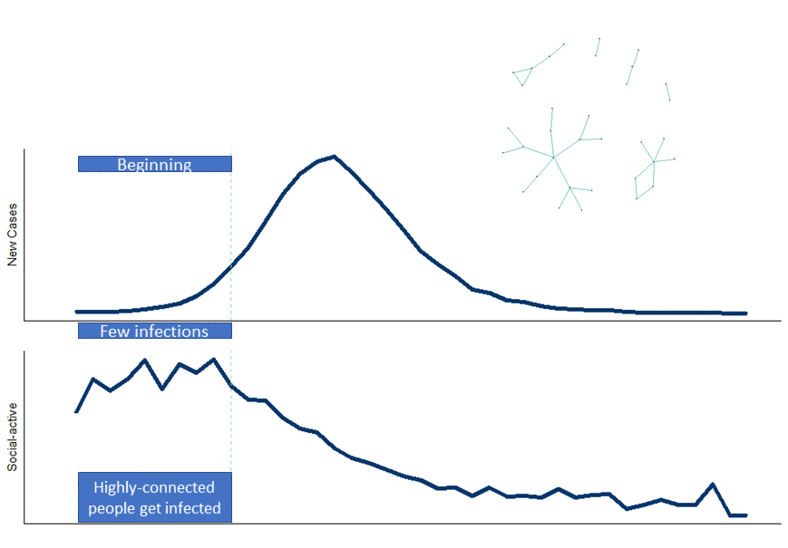
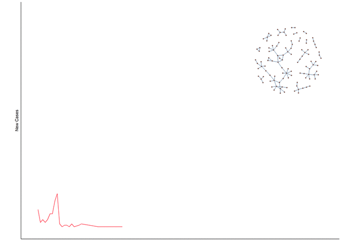

<b> Simplest model: </b>
- Discrete periods.
- People have connections (friendship, family, co-workers, daily interacctions, random). 
- In each period a certain number of connections are chosen, and if they are chosen and one is infected, and the other is not. There is a certain probability that the non-infected gets sick.

<b> Model assumptions </b>
<b>Assumption 0. </b>
 
Number of people in the model </b>
- If we want to model Switzerland, the number of people is approximately 8.57 M.
- If we want to model Italy, the number of people is approximately 60.58 M.
* Input: Size of network (n)

<b>Assumption 1. </b>
 
<b>People's contections </b> (Friendship, Family, co-workers, drive in the same bus to work, etc.)
 
1.1 Random graph: people meet randomly on the street. Use random graph models G(n,p):
- p, p*(n-1) is the expected number of people that a person is connected to.
- n number of people (size of the network), and it comes from assumption 0.
* Input: p.
* Output: edge list.
 
1.2  Stochastic block model: people meet in groups of friends, classrooms, workplace. 

- Input size of the communities (Implicit assumptions is the number of communities).
- Probability that two individual in the same community meet.
- Probability that two individual in different communities meet. (we can set it to zero).
* Input: vector with size of community. 
* Input: probability matrix with probability that individual between/within communities meet. The entries in cell are zero except for the diagonal. This is because this part of the model does not create edges/connections between people that are not in the same community. This assumption is in 1.1.
* Output: edge list

1.3  Preferantial attachment. A few people have a lot of contacts (a lot of friends, they work in places with a lot of contact with strangers). We can use Barabási–Albert algorithm.

* At the edge, the edges (links, connections) equals the total edges generated in assumption 1.1, 1.2 and 1.3. However, there is at most one link between people. For instance, if a link between a, b is generated in 1.1, 1.2, it means that there is only one link (eliminate duplicate). 

 

<b>Assumption 2.</b>
 
</b>Initial condition</b>
Initial people infected
- Percentage of people infected. Randomized in the whole population
- Community infected, and percentage of people infected.
- Network topology
 

<b>Assumption 3.</b>
<b> People interacting in a certain period in a certain period  </b>
 
Option A. In each period, a percentage of people are chosen at random and interact.
- Percentage of people interacting.
- Numer of people they interact with  or percentage of people they interact with.
 
Option B. In each period, a percentage of relations are chosen at random. We assume that people relations interact at period t.
 

  
<b>Assumption 4.</b>
 
<b> Likelyhood that a sick people infect a healthy person (Susceptible) if they interact. </b>
- Probability of transmiting the disease.
Implicit assumption: people that recovered are not affected again. We can relax this assumption by having a different transmition probability between infected and a recovered person.
 *  Input: Probability of transmiting the virus (virus specific) 
 
 <b>Assumption 5.</b>
 <b> Duration that an infected people remains infected</b>
  
 -Time a person is sick and can transmit the disease.
* Input: Time a infected person can infect other peopl. If time=5, it means that an infected person at time t can still infect people at time t+1,...,t+5

  Vizualisations: </b>
* (Important): Plot the percentage people infected and recovered over time.
* (Important): Plot the percentage people NEW infected and recovered over time.
* The subnetwork of people infected at certain point.
* If we also keep track on who infected who, we can vizualize the cascade effect tha  one infected-person can produce.  
* (Optional)Plot the percentage people infected over time, and split by communities. This is important, if we simulate that the first infections occur in a certain community, and the peprcerntage of people infected by communities will be different over time.
* (Optional) Plot the degree distribution of infected people over time 

<b> Output: </b>
At each period:
- The number of infected people
- Number of healthy people (susceptible), infected, recovered.
- Time when a person was infected for the first time
- Network topology.
- State of each node (susetible,infected and recovered).

<b>Model building: </b>
 
Model: People are represented as nodes, and connections as links. Each node has is in one state susetible, infected or recovered.
 
1. Buld the network topology with assumptions 0 and 1.
 
1.1 Fix the number of people (n, number of nodes in the network).
 
1.2.1 For Switzerland, we will need to generate a network of 8.5M onf nodes, while for Italy, 60.5M of nodes.
 
1.2 For the random interactions fix p, the probability that two random people meet. The way p is chosen is to fix the expeted number of random encounters, and thus p is a function of n.
 
For instance, if the number of random encounters is 5, then p=5/(n-1). Thus, p will be different for Swizterland and Italy, since their population is different even if we assume the same expected number of random interactions.
 
1.3.1 Fix the number of communities,  their size of the communities, and the probability that two people between a community meet. Two people can be in more than one community. For instance, they can be in the community of Zurich, in the ETH community and in the classroom community.
 
1.4 Preferential attachment...
 
1.5.
 

<b> Properties </b>
For networks, important properties to look at are:
 
a. Degree distribution.
 
b. Transitivity
 
c. Isolated nodes.

 
2. Create initial conditions of people infected with assumption 2.
3.  Simulate periods: New infected people, people recovered. 

   
<b> Examples </b>
If we keep track on the infected, and their network topology, we can determine if the most connected people are more likely to be infected at the beginning of the epidemic.

<b>Figure 1.</b> Network shows the infected people and their connections with other infected people at period 4. The top plot shows the evolution of new infections. The plot at the bottom plots the average degree of those infected over time (Toy example)

 

Lockdown:
If we want to simulate a lockdown, we can reduce the percentage of people that interct in a certain period (Assumption 3).  With the lockdown, we do not modify assumption 4. If we assume a policy of social-distancing (2-meters), then we can change the parameter in assumption 4.
With option B, we can reduce the probability that certain connections interact. For instance, we can limit the interaction of clusters of group larger than a certain group. However, this means that we must label the edges, computationally expensive.

<b> Figure 2.<b> Network shows the infected people and their connections with other infected people at period 4. The top plot shows the evolution of new infections. The plot at the bottom plots the average degree of those infected over time (Toy example)

